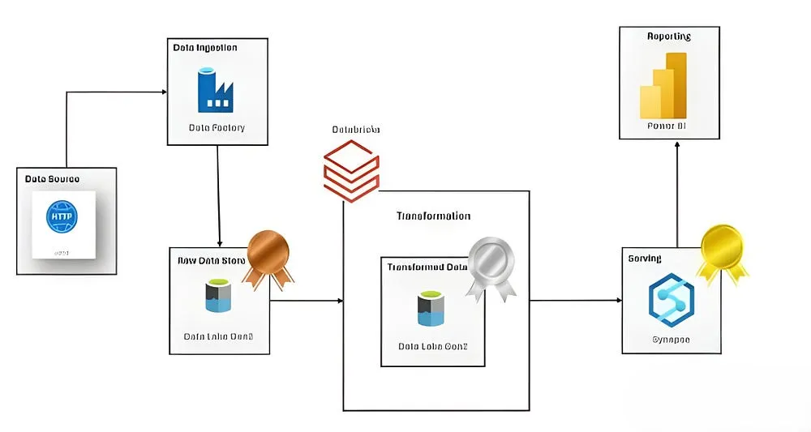

# End-to-End Data Platform for AdventureWorks on Azure
## 1. Project Overview
This project implements a complete, end-to-end data engineering solution on the Microsoft Azure platform using the AdventureWorks dataset. The primary objective is to build a robust and automated pipeline that ingests data from disparate sources, processes it through a multi-layered architecture, and establishes a "Single Source of Truth" for reliable business intelligence and analytics.

The solution is built for scalability and maintainability, leveraging dynamic, metadata-driven pipelines in Azure Data Factory and a modern data warehousing approach with Azure Synapse Analytics.

## 2. Business Objective
The AdventureWorks company struggled with data inconsistency and scattered information across various systems. This project addresses that challenge by creating a centralized data platform that:

* Consolidates raw data into a structured and reliable analytics-ready format.

* Provides a single, trustworthy source for all reporting and data analysis, eliminating discrepancies.

* Enables business analysts and decision-makers to access and explore curated data through Power BI, driving insights on sales, products, and customers.

## 3. Tech Stack
   
| Service                 | Role                          | Description                                                                 |
| ----------------------- | ----------------------------- | --------------------------------------------------------------------------- |
| **Azure Data Factory** | Data Ingestion & Orchestration | Used to create automated pipelines to ingest data from source systems.        |
| **Azure Data Lake Gen2** | Data Lake Storage             | Centralized storage for raw (Bronze), cleaned (Silver), and aggregated (Gold) data. |
| **Azure Databricks** | Data Transformation (ETL)     | Leveraged PySpark notebooks to clean, transform, and model the data.        |
| **Azure Synapse Analytics**| Data Warehousing              | Serves the final, curated Gold layer data in a dedicated SQL pool for fast querying. |
| **Power BI** | Data Visualization            | Connected to Synapse Analytics to create interactive dashboards and reports.  |
| **Python (PySpark)** | Transformation Language       | Primary language used within Databricks for all data manipulation logic.    |
| **SQL** | Querying Language             | Used in Synapse Analytics and Databricks for data querying and validation.  |

# 4. Architecture
The pipeline is designed around a Medallion Architecture, ensuring data quality and governance by progressively refining data through Bronze, Silver, and Gold layers.

### Data Flow:

* Ingest (Bronze): A dynamic Azure Data Factory pipeline fetches raw CSV files from source GitHub URLs. Using Lookup and ForEach activities, the pipeline iterates through a list of files and lands them in the Bronze layer of Azure Data Lake Gen2.

* Transform (Silver): An Azure Databricks notebook is triggered by ADF. It reads the raw data from the Bronze layer, applies cleaning and transformation logic (e.g., handles nulls, standardizes data types), and stores the refined data in the Silver layer as optimized Delta tables.

* Serve (Gold): Azure Synapse Analytics provides the analytics endpoint. A serverless SQL pool is used to create SQL Views directly on top of the Silver layer Delta tables in the data lake. These views represent the curated, business-ready Gold layer, avoiding data duplication and reducing storage costs.

Visualize: Power BI connects directly to the Azure Synapse Analytics serverless endpoint, querying the Gold layer views to generate real-time, interactive dashboards for business users.

# 5. Project Workflow & Data Pipeline
Step 1: Dynamic Data Ingestion (ADF)

A single, reusable Azure Data Factory pipeline, PL_Dynamic_Ingest_From_GitHub, was created.

A Lookup Activity reads a configuration file (e.g., a JSON or CSV) that contains a list of source GitHub URLs and corresponding destination table names.

A ForEach Loop iterates over the output of the Lookup activity.

Inside the loop, a parameterized Copy Data Activity dynamically constructs the source URL and destination path, copying each file into the bronze/ directory in ADLS Gen2. This approach makes the pipeline metadata-driven and easily scalable to new data sources.

Step 2: Data Transformation (Databricks)

The notebook Bronze_to_Silver.ipynb is executed after the ingestion pipeline completes.

It mounts the ADLS Gen2 storage for seamless access.

It reads the raw data from the Bronze layer, performs necessary cleaning operations, and applies schemas.

The cleaned, structured data is written to the silver/ directory as Delta tables, providing reliability and performance benefits.

Step 3: Data Serving via Synapse Views (Gold Layer)

An Azure Synapse Analytics workspace is set up and linked to the ADLS Gen2 account.

Using the serverless SQL pool, SQL Views are created with CREATE VIEW statements.

Each view directly queries a corresponding Delta table in the Silver layer (e.g., CREATE VIEW vw_DimProduct AS SELECT * FROM OPENROWSET(...)).

These views act as the logical Gold layer, providing a clean, governed, and high-performance SQL endpoint for Power BI without needing to move and duplicate data.

# 6. Power BI Dashboard Showcase
The final dashboard connects to the Synapse views and offers insights into AdventureWorks' operations.

Example Placeholder 1: AdventureWorks Sales Overview

Example Placeholder 2: Product Performance Analysis

Example Placeholder 2: Product Details

# 7. Repository Structure

# 8. How to Replicate
To replicate this project, you will need:

An active Azure Subscription.

Power BI Desktop installed.

Clone this repository: git clone (https://github.com/abinya15/End-to-End-Azure-Project---AdventureWorks)

Deploy the Azure resources (ADF, ADLS, Databricks, Synapse).

Upload the source AdventureWorks CSV files to a GitHub repository or update the ADF configuration to point to a new source.

Publish the ADF pipeline and run it to begin the data flow.

Execute the create_gold_layer_views.sql script in your Synapse workspace.

Update the Power BI file to connect to your Synapse serverless SQL endpoint.

# 9. Future Improvements
CI/CD: Implement CI/CD pipelines using Azure DevOps or GitHub Actions to automate the deployment of all resources (ARM templates), Databricks notebooks, and Synapse SQL scripts.

Data Quality Checks: Integrate a data quality framework like Great Expectations to run automated checks within the Databricks notebooks to validate data as it moves from Bronze to Silver.

Logging & Monitoring: Set up Azure Monitor to track pipeline runs, log errors, and create alerts for pipeline failures or data quality issues.
